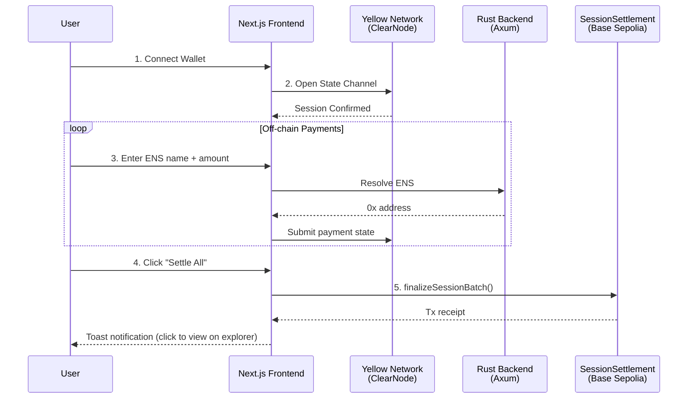
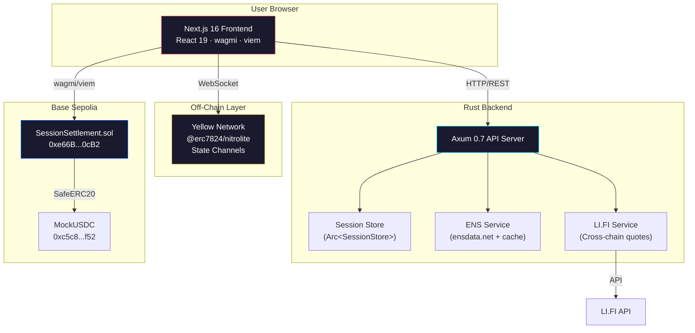
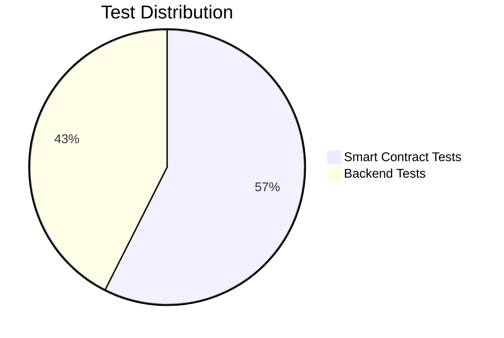

# SettleOne

### Send USDC anywhere. Settle once.

A **cross-chain, identity-powered USDC payment platform** that batches off-chain payments through Yellow Network state channels and settles them in a single on-chain transaction on Base. Built for **ETHGlobal HackMoney 2026**.

---

## The Problem

| Pain Point | Impact |
|---|---|
| **High gas fees** | Every payment costs a separate transaction — prohibitive for frequent or micro-payments |
| **Fragmented chains** | Users juggle bridges, different tokens, and incompatible wallets across L1s and L2s |
| **Raw hex addresses** | Sending to `0x699e...1082` is error-prone and hostile to everyday users |

SettleOne eliminates all three by combining **off-chain state channels**, **ENS identity**, **cross-chain routing**, and **batch on-chain settlement** into one seamless flow.

---

## How It Works



### Five Steps to Settlement

| Step | Action | Where |
|:---:|---|---|
| **1** | Connect wallet (MetaMask / Phantom) | Frontend |
| **2** | Start session — opens a Yellow Network state channel | Off-chain |
| **3** | Add payments — type `vitalik.eth` + amount, instant off-chain | Off-chain |
| **4** | (Optional) Cross-chain quote via LI.FI if bridging is needed | Backend |
| **5** | Settle once — one on-chain batch transaction settles everything | On-chain |

---

## Architecture



---

## Key Features

| Feature | Description |
|---|---|
| **ENS-Powered Payments** | Send USDC to `name.eth` — resolved on both frontend (viem) and backend (ensdata.net API with TTL cache) |
| **Session-Based UX** | Batch unlimited payments off-chain during a session, settle all at once |
| **Yellow Network State Channels** | Full `@erc7824/nitrolite` SDK — auth, session creation, state updates, close |
| **Cross-Chain Routing** | LI.FI quotes with fee breakdown, estimated time, and "Bonus" display for negative fees |
| **Batch On-Chain Settlement** | Single `finalizeSessionBatch()` call transfers USDC to all recipients |
| **Security Hardened** | Reentrancy guards, integer overflow protection, allowance pre-validation, tx confirmation waiting |
| **Toast Notifications** | Clickable toast opens the correct block explorer per chain |
| **Dynamic Explorer URLs** | Supports Base Sepolia, Base Mainnet, Ethereum, and Sepolia |

---

## Tech Stack

| Layer | Technology | Details |
|---|---|---|
| **Frontend** | Next.js 16 · React 19 · TypeScript | Tailwind CSS v4, wagmi 3, viem, RainbowKit, react-hot-toast |
| **Backend** | Rust · Axum 0.7 · Tokio | reqwest, serde, thiserror/anyhow, TTL caching |
| **Contracts** | Solidity 0.8.20 · Hardhat | OpenZeppelin (ReentrancyGuard, SafeERC20, Ownable) |
| **Off-Chain** | Yellow Network | `@erc7824/nitrolite` state channels via ClearNode WebSocket |
| **Cross-Chain** | LI.FI API | Quote fetching, fee breakdown, multi-chain routing |
| **Identity** | ENS | Forward + reverse resolution, avatar fetching |

---

## Sponsor Tracks

### 1. Yellow Network — Off-Chain Payments

Full `@erc7824/nitrolite` SDK integration with ClearNode WebSocket (`wss://clearnet.yellow.com/ws`).

| Capability | Implementation |
|---|---|
| Authentication | Challenge-response flow via `createAuthRequestMessage` / `createAuthVerifyMessageFromChallenge` |
| Session Creation | `createAppSessionMessage` with ClearNode confirmation (30s timeout) |
| State Updates | `createSubmitAppStateMessage` with proper allocations (sender=0, recipient=cumulative) |
| Session Close | `createCloseAppSessionMessage` returns settlement data |
| Heartbeat | `createPingMessageV2` keepalive |

**Code Review**: Greptile **5/5** confidence score — *"Production-ready for hackathon scope"* (PR #13)

### 2. Circle / Arc — USDC Settlement

| Item | Value |
|---|---|
| Token | USDC (6 decimals) via `MockUSDC.sol` |
| Contract | `0xe66B3Fa5F2b84df7CbD288EB3BC91feE48a90cB2` |
| Network | Base Sepolia (Chain ID: 84532) |
| Explorer | [View on BaseScan](https://sepolia.basescan.org/address/0xe66B3Fa5F2b84df7CbD288EB3BC91feE48a90cB2) |

### 3. ENS — Identity-Powered Payments

- **Frontend**: `useENS` hook with debounced resolution via viem mainnet client
- **Backend**: `EnsService` singleton resolving via ensdata.net API with TTL-based cache
- **UI**: `ENSInput` component with real-time resolution, avatars, loading states

### 4. LI.FI — Cross-Chain Routing

- **Backend proxy**: `LifiService` fetches quotes from `li.quest/v1` API
- **Frontend**: `QuoteDisplay` component showing send/receive amounts, bridge fees (%), gas estimate, and estimated time
- **Negative fee handling**: Displayed as green "Bonus" when user receives more than expected

---

## Test Suite

**47 tests** across the project — all passing.



### Smart Contract Tests (27)

| Category | Count | Coverage |
|---|:---:|---|
| Deployment | 4 | Constructor validation, immutable state |
| Session Management | 3 | Start, duplicate prevention |
| Single Settlement | 6 | Success path, error cases |
| Batch Settlement | 8 | Multi-recipient, overflow protection, allowance validation |
| Admin Functions | 3 | Emergency withdraw, access control |
| View Functions | 2 | Status queries, metadata |
| Security | 1 | Integer overflow protection |

### Backend Tests (20)

| Category | Coverage |
|---|---|
| Utility Functions | Address validation, ENS validation, formatting |
| Session Models | Creation, payment addition, total recalculation |
| Session Store | CRUD operations, status transitions |
| ENS Resolution | Real API calls, caching behavior, error handling |

```bash
cd contracts && pnpm test    # 27 passing
cd backend && cargo test     # 20 passing
```

---

## Security

| Protection | Location | Description |
|---|---|---|
| **Reentrancy Guard** | `SessionSettlement.sol` | OpenZeppelin `ReentrancyGuard` on all state-changing functions |
| **Integer Overflow** | `_calculateAndValidateBatch()` | `unchecked` block with explicit overflow check + `BatchAmountOverflow` error |
| **Allowance Pre-Validation** | `finalizeSession` / `finalizeSessionBatch` | Checks allowance before any state changes |
| **Tx Confirmation Wait** | `useSettlement.ts` | `waitForTransactionReceipt` with 1 confirmation before proceeding |
| **WebSocket Guards** | `yellow.ts` | Duplicate connection prevention, disconnect promise rejection |
| **Safe BigInt Parsing** | `QuoteDisplay.tsx` | `safeParseBigInt()` validates input before `BigInt()` |
| **Custom Errors** | `SessionErrors.sol` | 10 gas-efficient custom errors (no revert strings) |

---

## Deployed Contracts

| Contract | Address | Network | Explorer |
|---|---|---|---|
| **SessionSettlement** | `0xe66B3Fa5F2b84df7CbD288EB3BC91feE48a90cB2` | Base Sepolia | [View](https://sepolia.basescan.org/address/0xe66B3Fa5F2b84df7CbD288EB3BC91feE48a90cB2) |
| **MockUSDC** | `0xc5c8977491c2dc822F4f738356ec0231F7100f52` | Base Sepolia | [View](https://sepolia.basescan.org/address/0xc5c8977491c2dc822F4f738356ec0231F7100f52) |

---

## Project Structure

```
SettleOne/
├── frontend/                    # Next.js 16 + React 19
│   └── src/
│       ├── app/                 # Pages, layout, globals
│       ├── components/          # ConnectButton, Providers, features/
│       │   └── features/        # ENSInput, PaymentForm, SessionCard, ChainSelector, QuoteDisplay
│       ├── hooks/               # useSession, useSettlement, useYellow, useENS, useQuote, useDebounce
│       ├── lib/                 # api.ts, contracts.ts, wagmi.ts, yellow.ts (1025 lines)
│       └── types/               # TypeScript definitions
├── backend/                     # Rust + Axum
│   └── src/
│       ├── api/                 # Handlers: session, ens, quote, error
│       ├── services/            # ENS (ensdata.net + cache), LI.FI, Session Store
│       ├── models/              # Session, Payment, Status enums
│       ├── config/              # Environment configuration
│       ├── utils/               # Address/ENS validation
│       └── main.rs              # AppState { SessionStore, EnsService }
├── contracts/                   # Solidity + Hardhat
│   ├── contracts/               # SessionSettlement, interfaces, libraries, mocks
│   ├── scripts/                 # Multi-network deploy script
│   └── test/                    # 27 comprehensive tests
└── docs/                        # Architecture, phases, session log, sponsor details
```

---

## Getting Started

### Prerequisites

- **Node.js** 18+
- **Rust** 1.75+
- **pnpm** (package manager)

### 1. Clone & Install

```bash
git clone https://github.com/AnkanMisra/SettleOne.git
cd SettleOne
```

### 2. Frontend

```bash
cd frontend
pnpm install
pnpm dev          # http://localhost:3000
```

### 3. Backend

```bash
cd backend
cp .env.example .env
# Edit .env with your RPC URL and API keys
cargo run         # http://localhost:3001
```

### 4. Smart Contracts

```bash
cd contracts
pnpm install
pnpm compile
pnpm test         # 27 tests
```

### Environment Variables

#### Backend (`backend/.env`)

| Variable | Default | Description |
|---|---|---|
| `PORT` | `3001` | Server port |
| `ETH_RPC_URL` | `https://eth.llamarpc.com` | Ethereum RPC for ENS |
| `LIFI_API_URL` | `https://li.quest/v1` | LI.FI API base URL |
| `LIFI_API_KEY` | — | LI.FI API key (optional) |
| `SETTLEMENT_CONTRACT_ADDRESS` | `0xe66B...0cB2` | Deployed contract |

#### Frontend (`frontend/.env.local`)

| Variable | Description |
|---|---|
| `NEXT_PUBLIC_API_URL` | Backend URL (default: `http://localhost:3001`) |
| `NEXT_PUBLIC_WALLETCONNECT_PROJECT_ID` | WalletConnect project ID |

---

## Code Quality

| Check | Command | Status |
|---|---|---|
| Rust format | `cargo fmt --check` | Passing |
| Rust lint | `cargo clippy -- -D warnings` | 0 warnings |
| Rust tests | `cargo test` | **20/20** passing |
| Frontend build | `pnpm build` | Passing |
| Frontend lint | `pnpm lint` | Passing |
| Contract tests | `pnpm test` | **27/27** passing |
| Greptile Review (PR #13) | Yellow SDK integration | **5/5** confidence |
| Greptile Review (PR #14) | Backend polish + ENS | **4.5/5** confidence |

---

## Project Completion

```mermaid
gantt
    title SettleOne Development Progress
    dateFormat X
    axisFormat %s%%

    section Components
    Smart Contracts          :done, 0, 100
    Frontend                 :done, 0, 95
    Backend                  :done, 0, 90
    SDK Integration          :done, 0, 90
    Testing & QA             :done, 0, 70
    Documentation            :done, 0, 95
    Deployment               :done, 0, 80
```



| Component | Progress | Highlights |
|---|:---:|---|
| **Smart Contracts** | 100% | Deployed, security hardened, 27 tests, custom errors |
| **Frontend** | 95% | Full UI, Yellow SDK, toast notifications, dynamic explorer |
| **Backend** | 90% | Real ENS resolution, shared state, 20 tests, rate-limit documented |
| **SDK Integration** | 90% | Yellow complete, LI.FI complete, ENS complete |
| **Testing & QA** | 70% | 47 total tests (27 contract + 20 backend) |
| **Documentation** | 95% | 8 docs files, comprehensive README, session log |
| **Deployment** | 80% | Contracts on Base Sepolia, frontend/backend deployment pending |
| **Overall** | **~97%** | |

---

## Links

| Resource | URL |
|---|---|
| GitHub Repository | [github.com/AnkanMisra/SettleOne](https://github.com/AnkanMisra/SettleOne) |
| SessionSettlement Contract | [BaseScan](https://sepolia.basescan.org/address/0xe66B3Fa5F2b84df7CbD288EB3BC91feE48a90cB2) |
| MockUSDC Contract | [BaseScan](https://sepolia.basescan.org/address/0xc5c8977491c2dc822F4f738356ec0231F7100f52) |
| Yellow Network Docs | [docs.yellow.org](https://docs.yellow.org) |
| LI.FI Docs | [docs.li.fi](https://docs.li.fi) |
| ENS Docs | [docs.ens.domains](https://docs.ens.domains) |

---

Built for **ETHGlobal HackMoney 2026**.
