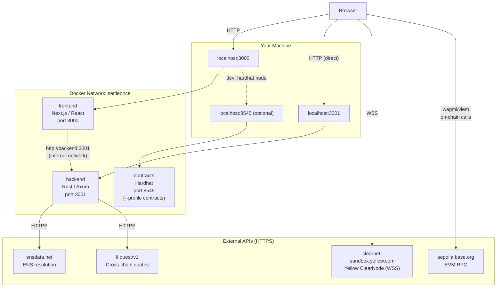
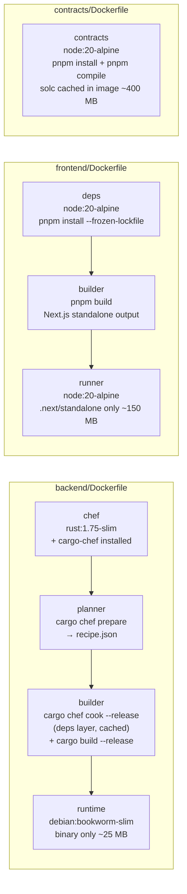
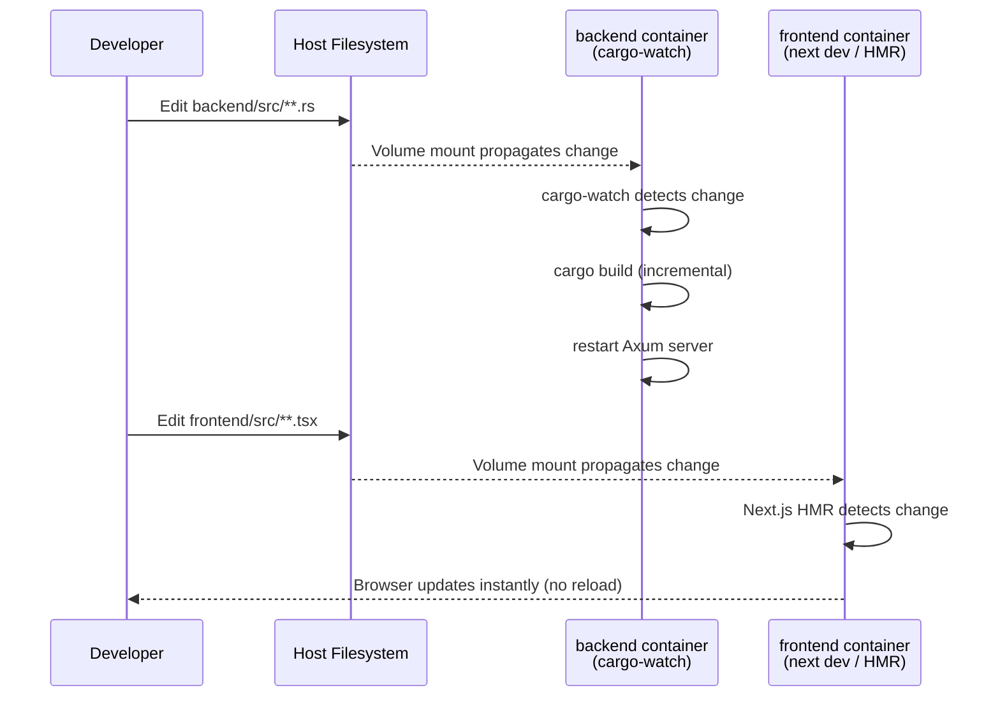
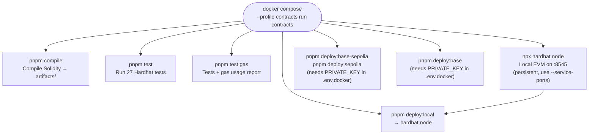
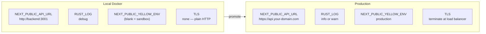

# Docker Guide

Complete guide to running SettleOnce with Docker. No Rust toolchain, Node.js, or pnpm required on your machine — only Docker.

## Prerequisites

- [Docker Engine 24+](https://docs.docker.com/engine/install/) or [Docker Desktop](https://www.docker.com/products/docker-desktop/)
- Docker Compose v2 (ships with Docker Desktop; or `apt install docker-compose-plugin`)

Verify:
```bash
docker --version          # Docker version 24+
docker compose version    # Docker Compose version v2.x
```

---

## Quick Start

```bash
# 1. Clone the repo
git clone <repo-url>
cd SettleOnce

# 2. Create your env file (all values have safe defaults — works out of the box)
cp .env.docker.example .env.docker

# 3. Build and start backend + frontend
docker compose up --build

# 4. Open in browser
#    Frontend:  http://localhost:3000
#    Backend:   http://localhost:3001
#    Health:    http://localhost:3001/health
```

That's it. No pnpm, no cargo, no Node.js install needed.

---

## Architecture

### Service communication



### Docker image build stages



### Dev mode — hot reload flow



---

## Environment Setup

Copy the example file and edit it:

```bash
cp .env.docker.example .env.docker
```

The stack works with an empty `.env.docker` for local development. Fill in optional API keys to unlock additional functionality:

| Variable | Default | What it does |
|---|---|---|
| `PORT` | `3001` | Backend listen port |
| `LIFI_API_KEY` | _(none)_ | Higher rate limits on LI.FI quote API |
| `YELLOW_API_KEY` | _(none)_ | Yellow Network API key |
| `NEXT_PUBLIC_API_URL` | `http://backend:3001` | Backend URL baked into frontend bundle |
| `NEXT_PUBLIC_ALCHEMY_ID` | _(none)_ | Alchemy RPC key (uses public fallback without it) |
| `NEXT_PUBLIC_WALLETCONNECT_ID` | _(none)_ | WalletConnect project ID |
| `NEXT_PUBLIC_YELLOW_ENV` | _(none)_ | Set to `production` for mainnet Yellow ClearNode |
| `PRIVATE_KEY` | _(none)_ | Deployer key for contract deployment only |

> **Note on `NEXT_PUBLIC_API_URL`**: When running both services together via `docker compose`, this **must** be `http://backend:3001` (the Docker service name), not `http://localhost:3001`. If you run the frontend container standalone (without the backend container), set it to wherever your backend is reachable.

---

## Running the Stack

### Production mode (default)

Builds optimised images and runs them:

```bash
docker compose up --build
```

Run in the background (detached):

```bash
docker compose up --build -d
```

Stop:

```bash
docker compose down
```

### Dev mode — hot reload

Mounts source code into the containers so changes reflect without a full rebuild:

```bash
docker compose -f docker-compose.yml -f docker-compose.dev.yml up --build
```

- **Backend**: `cargo-watch` recompiles and restarts on any `.rs` file save. First compile takes ~2 min; subsequent ones are seconds thanks to incremental compilation cached in a named volume.
- **Frontend**: Next.js dev server with HMR. Changes to `src/` appear in the browser immediately.

Add a shell alias to avoid retyping the flags:

```bash
# Add to ~/.zshrc or ~/.bashrc
alias dcdev="docker compose -f docker-compose.yml -f docker-compose.dev.yml"

dcdev up --build
dcdev logs -f
dcdev down
```

### Individual services

```bash
# Start only the backend
docker compose up --build backend

# Start only the frontend (backend must already be running or accessible)
docker compose up --build frontend

# Rebuild and restart a single service without touching others
docker compose up --build --no-deps frontend
```

---

## Contracts

The `contracts` service is gated behind the `contracts` profile so it never starts accidentally. Use `docker compose run` (not `up`) since it's a one-shot tool, not a persistent service.

### Workflow



### Compile contracts

```bash
docker compose --profile contracts run --rm contracts pnpm compile
```

### Run the test suite

```bash
docker compose --profile contracts run --rm contracts pnpm test
```

### Run tests with gas report

```bash
docker compose --profile contracts run --rm contracts pnpm test:gas
```

### Start a local Hardhat node

Starts an EVM node on `http://localhost:8545` that stays running:

```bash
docker compose --profile contracts run --rm --service-ports contracts npx hardhat node
```

Once running, deploy contracts to it:

```bash
# In a second terminal
docker compose --profile contracts run --rm contracts pnpm deploy:local
```

### Deploy to testnets/mainnet

Set `PRIVATE_KEY` and the relevant `*_RPC_URL` in `.env.docker` first.

```bash
# Base Sepolia
docker compose --profile contracts run --rm contracts pnpm deploy:base-sepolia

# Sepolia
docker compose --profile contracts run --rm contracts pnpm deploy:sepolia

# Base mainnet
docker compose --profile contracts run --rm contracts pnpm deploy:base
```

---

## Useful Commands

### Logs

```bash
# All services
docker compose logs -f

# Single service
docker compose logs -f backend
docker compose logs -f frontend

# Last 50 lines
docker compose logs --tail=50 backend
```

### Shell access

```bash
# Get a shell inside the running backend container
docker compose exec backend sh

# Get a shell inside the running frontend container
docker compose exec frontend sh

# Get a shell in a one-off contracts container
docker compose --profile contracts run --rm contracts sh
```

### Health check

```bash
# Check the backend health endpoint directly
curl http://localhost:3001/health
# Expected: {"status":"ok","version":"0.1.0"}

# See container health status
docker compose ps
```

### Rebuild after code changes

In production mode, any source change requires a rebuild:

```bash
# Rebuild everything
docker compose up --build

# Rebuild only the backend (faster if only Rust changed)
docker compose up --build --no-deps backend

# Rebuild only the frontend
docker compose up --build --no-deps frontend
```

> **Frontend rebuild note**: If you change any `NEXT_PUBLIC_*` environment variable in `.env.docker`, you must rebuild the frontend image — these values are baked in at build time.

### Clean up

```bash
# Stop containers, keep images and volumes
docker compose down

# Stop containers and remove volumes (dev cache — next start will recompile from scratch)
docker compose down -v

# Remove built images too
docker compose down --rmi local

# Nuclear — remove everything Docker-related for this project
docker compose down -v --rmi local
docker volume rm settleonce-cargo-registry settleonce-cargo-target 2>/dev/null || true
```

---

## Image Sizes (approximate)

| Image | Size | Notes |
|---|---|---|
| `settleonce-backend` | ~25 MB | Debian slim + compiled binary only |
| `settleonce-frontend` | ~150 MB | Node alpine + Next.js standalone output |
| `settleonce-contracts` | ~400 MB | Node alpine + full Hardhat + Solidity compiler |

The contracts image is large because Hardhat downloads the Solidity compiler on first compile. It's only used for development and CI — not deployed.

---

## Production Deployment

### Building production images

```bash
# Tag images for your registry
docker build -t your-registry/settleonce-backend:v1.0.0 ./backend
docker build \
  --build-arg NEXT_PUBLIC_API_URL=https://api.your-domain.com \
  --build-arg NEXT_PUBLIC_ALCHEMY_ID=your-key \
  -t your-registry/settleonce-frontend:v1.0.0 \
  ./frontend

# Push
docker push your-registry/settleonce-backend:v1.0.0
docker push your-registry/settleonce-frontend:v1.0.0
```

### Local vs production environment



### Running on a VPS with Docker Compose

```bash
# On the server
git clone <repo-url>
cd SettleOnce
cp .env.docker.example .env.docker
nano .env.docker   # fill in production values

docker compose up --build -d
```

The backend's `/health` endpoint is suitable for use as a load balancer health check target.

---

## Troubleshooting

### Frontend can't reach the backend

**Symptom**: Network errors in the browser, API calls fail.

**Cause**: The frontend was built with `NEXT_PUBLIC_API_URL=http://localhost:3001` but the backend is not reachable at `localhost` from inside the container.

**Fix**: Ensure `.env.docker` has `NEXT_PUBLIC_API_URL=http://backend:3001` and **rebuild** the frontend image:

```bash
docker compose up --build --no-deps frontend
```

---

### Backend fails to start — port already in use

**Symptom**: `Error starting userland proxy: listen tcp 0.0.0.0:3001: bind: address already in use`

**Fix**: Something on your machine is using port 3001. Either stop it, or change the host port mapping in `docker-compose.yml`:

```yaml
ports:
  - "3002:3001"   # host port 3002 maps to container port 3001
```

---

### Rust build runs out of memory

**Symptom**: `cargo build` killed mid-compile, or `signal: killed` in Docker logs.

**Cause**: Rust compilation is memory-hungry (~1.5–2 GB peak). Docker Desktop on macOS/Windows may have a low memory limit.

**Fix**: Open Docker Desktop → Settings → Resources → Memory → increase to at least 4 GB.

---

### cargo-watch not found in dev mode

**Symptom**: Dev backend container exits with `sh: cargo-watch: not found`

**Cause**: `cargo-watch` is baked into the `builder` stage of `backend/Dockerfile`. If you're seeing this, your image is stale — it was built before this was added.

**Fix**: Force a full rebuild of the backend image:

```bash
docker compose -f docker-compose.yml -f docker-compose.dev.yml build --no-cache backend
```

---

### Contracts: `pnpm compile` fails with "no solc version"

**Symptom**: Hardhat can't download the Solidity compiler inside Docker.

**Cause**: The container might not have network access to download the compiler binary.

**Fix**: The `contracts/Dockerfile` runs `pnpm compile` at image build time so the compiler is already cached in the image. If you get this error during `docker compose run`, rebuild the image:

```bash
docker compose --profile contracts build --no-cache contracts
```

---

### Next.js build fails: `output: standalone` missing static files

**Symptom**: Frontend starts but returns 404 for all routes.

**Cause**: The `frontend/Dockerfile` expects `output: "standalone"` in `next.config.ts`. This was added as part of Docker support. If you see this, verify `frontend/next.config.ts` contains `output: "standalone"`.

---

### Changes not reflected after editing source

In **production mode** (`docker compose up`): source is copied into the image at build time. You must rebuild:

```bash
docker compose up --build
```

In **dev mode** (`docker compose -f docker-compose.yml -f docker-compose.dev.yml up`): source is mounted as a volume. Changes should reflect automatically:
- Frontend: instant (HMR)
- Backend: within a few seconds (cargo-watch recompile)

If dev mode changes are not reflecting, check the backend container logs for compile errors:

```bash
docker compose logs -f backend
```
